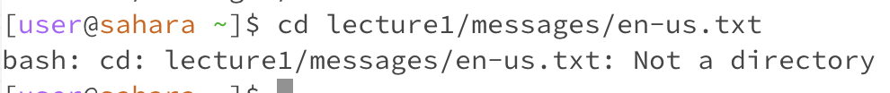

# Lab 1 Report

## Cd - no arguments

**Working directory:** /home
**Reason:** Cd with no arguments makes your working directory /home. Because I was already in /home, it appears that nothing happened. If I was in a subdirectory, there would have been a change. 
**Error?** Not an error

## Ls - no arguments

**Working directory:** /home
**Reason:** Ls with no arguments lists everything in the working in the directory. 
**Error?** Not an error

## Cat - no arguments

**Working directory:** /home
**Reason:** Cat with no arguments continues to prompt the user for input, reads the input, and then prints it out. It does not stop until the user terminates the operation. This is the intended purpose of cat with no arguments. 
**Error?** Not an error

## Cd - path to directory

**Working directory:** /home
**Reason:** Cd with a path to directory changes the working directory to the given path. You can see that my working directory becomes lecture1/
**Error?** Not an error

## Ls - path to directory

**Working directory:** /home
**Reason:** Ls will list everything within the directory passed.  
**Error?** Not an error

## Cat - path to directory

**Working directory:** /home
**Reason:** Cat is intended for files and a directory is not a file. 
**Error?** This is an error because cat was expecting an argument that is a path to file and I passed in a path to a directory instead. 

## Cd - path to file

**Working directory:** /home
**Reason:** Cd is intended for directories and a file is not a directory
**Error?** This is an error because cd was expecting a path to a directory and I passed in a path to a file instead. 

## Ls - path to file

**Working directory:** /home
**Reason:** Ls will just print the path of the file given. Ls works with both files and directories. 
**Error?** Not an error

## Cat - path to file

**Working directory:** /home
**Reason:** Cat with a path to a file as an argument will print out the contents of the given file. 
**Error?** Not an error

