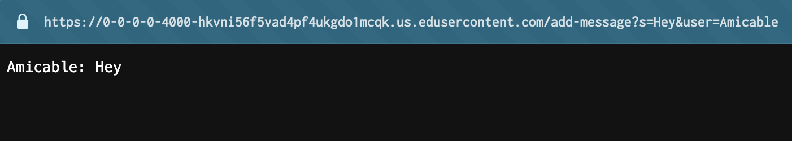

# Lab 2 Report

## Part 1 

### Code snippet of ChatServer.java

```java
import java.io.IOException;
import java.net.URI;
import java.util.ArrayList;

class Handler implements URLHandler {
    // A string holding the chat log that will be added onto with each /add-message request
    String chatLog = "";

    // Intended function: /add-message?s=<string>&user=<string>
    
    public String handleRequest(URI url) {
        if (url.getPath().equals("/")) {
            return String.format("Use /add-message to add a message.");
        } else if (url.getPath().equals("/add-message")) {
            String[] parameters = url.getQuery().split("=");
            String user = parameters[2];
            String temp = parameters[1];
            String[] messageTemp = temp.split("&");
            String message = messageTemp[0];
            chatLog += user + ": " + message + "\n";
            return chatLog;
        } else {
            return "404 Not Found!";
        }
    }
}

class ChatServer {
    public static void main(String[] args) throws IOException {
        if(args.length == 0){
            System.out.println("Missing port number! Try any number between 1024 to 49151");
            return;
        }

        int port = Integer.parseInt(args[0]);

        Server.start(port, new Handler());
    }
}
```

### Screenshot 1: `/add-message?s=Hey&user=Amicable`



**Which methods in your code are called?** The `handleRequest` method is called when the request is made.
**What are the relevant arguments to those methods?** The URI `https://0-0-0-0-4000-hkvni56f5vad4pf4ukgdo1mcqk.us.edusercontent.com/add-message?s=Hey&user=Amicable' is passed in as an argument.
**What are the values of the relevant fields in the class?** 
`String chatLog`: `"Amicable: Hey"`
`String[] parameters`: 
