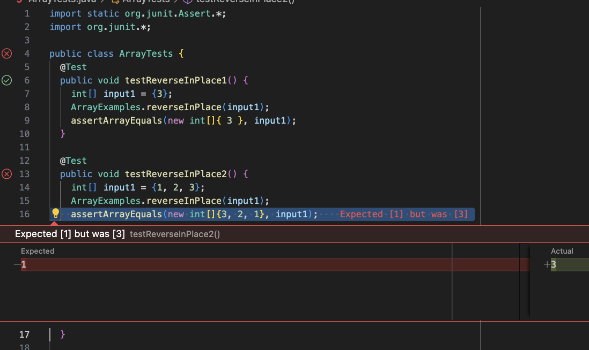
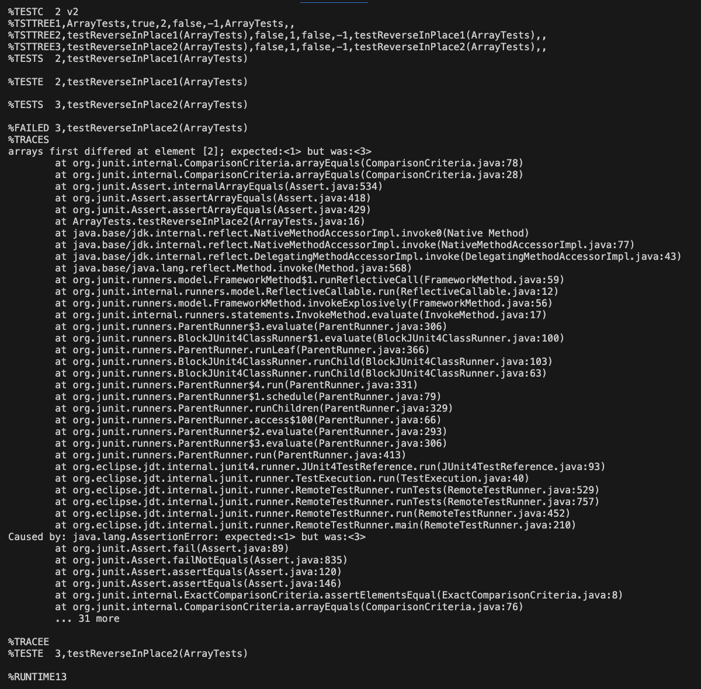

# Lab Report 3

# Part 1

For this part, I have chosen the bug with the `reverseinPlace()` method in `ArrayExamples.java`.

## A failure inducing input for the buggy program

```java
@Test 
public void testReverseInPlace2() {
    int[] input1 = {1, 2, 3};
    ArrayExamples.reverseInPlace(input1);
    assertArrayEquals(new int[]{3, 2, 1}, input1);
}
```

## An input that doesn't produce a failure

```java
@Test 
public void testReverseInPlace1() {
    int[] input1 = {3};
    ArrayExamples.reverseInPlace(input1);
    assertArrayEquals(new int[]{ 3 }, input1);
}
```

## The symptom

This screenshot shows the failure within the `ArrayTests.java` file.


This screenshot shows the "Test Results" output.


## The bug

### Before
```java
// Changes the input array to be in reversed order
static void reverseInPlace(int[] arr) {
    for(int i = 0; i < arr.length; i += 1) {
      arr[i] = arr[arr.length - i - 1];
    }
}
```

### After
```java
// Changes the input array to be in reversed order
static void reverseInPlace(int[] arr) {
    // Only iterate until the middle of the array
    for (int i = 0; i < arr.length / 2; i++) {
      // Swap element at i with its counterpart from the end
      int temp = arr[i];
      arr[i] = arr[arr.length - 1 - i];
      arr[arr.length - 1 - i] = temp;
    }
}
```
The issue with the "Before" code is that it tries to replace each element without temporarily saving the original value. When the loop reaches the middle of `arr`, the values in the first part of the array have already been overwritten with the values from the second half. When it tries to set the values in the second half of the array, it does not take from the original first half of the array as intended.

The fix in the "After" code stops swapping once `arr` gets to the middle. This way, nothing is overwritten. A `temp` variable is created to store the original integer in the first part of the array. The item in the first part of the array is then overwritten with the item in the second part of the array. Lastly, the item in the second part of the array is overwritten with the item stored in `temp`.

# Part 2

For this part, I am choosing to research the `find` command.
&nbsp;\
&nbsp;
## Option 1: `find -size`

**Source 1:** Entering `man find` into the terminal.\
**Source 2:** [Computer Hope](https://www.computerhope.com/unix/ufind.htm#Operators)

According to `man`, the `find -size` traverses the file hierarchies in lexographical order. From *Computer Hope*, I learned that the `-size` command is considered a test because it returns true if the file matches the given condition. 

&nbsp;\
***Example 1***
 
    
**Working Directory:** `terminal/`

The code below searches the current directory `terminal/` using `find .`. The test `-size +100k` indicates that the `find` command will check all files in `.` and determine whether or not each file takes up more than 100k of space. The output is all files recursively found in `terminal/` with a size greater than 100 kilobytes. 

```
amicable@Alexas-MacBook-Pro technical % find . -size +100k
./government/About_LSC/commission_report.txt
./government/About_LSC/State_Planning_Report.txt
./government/Env_Prot_Agen/multi102902.txt
./government/Env_Prot_Agen/ctm4-10.txt
./government/Env_Prot_Agen/bill.txt
./government/Env_Prot_Agen/tech_adden.txt
./government/Gen_Account_Office/d0269g.txt
./government/Gen_Account_Office/GovernmentAuditingStandards_yb2002ed.txt
./government/Gen_Account_Office/Sept27-2002_d02966.txt
./government/Gen_Account_Office/d01376g.txt
./government/Gen_Account_Office/Statements_Feb28-1997_volume.txt
./government/Gen_Account_Office/pe1019.txt
./government/Gen_Account_Office/gg96118.txt
./government/Gen_Account_Office/d01591sp.txt
./government/Gen_Account_Office/im814.txt
./government/Gen_Account_Office/ai9868.txt
./government/Gen_Account_Office/May1998_ai98068.txt
./government/Gen_Account_Office/d02701.txt
./biomed/1471-2105-3-2.txt
./911report/chapter-13.4.txt
./911report/chapter-13.5.txt
./911report/chapter-13.2.txt
./911report/chapter-13.3.txt
./911report/chapter-3.txt
./911report/chapter-1.txt
./911report/chapter-6.txt
./911report/chapter-7.txt
./911report/chapter-9.txt
./911report/chapter-12.txt
```
&nbsp;\
***Example 2***

    
**Working Directory:** `terminal/`

To explore whether or not the `-size` test checks for directories, I modified the command from above to only search for directories using `-type d`. Looking inside the `government/` directory using `find government/`, I recursively checked for all directories with a size less than 2 kilobytes. 

```
amicable@Alexas-MacBook-Pro technical % find government/ -size -2k -type d 
government/
government//About_LSC
government//Env_Prot_Agen
government//Alcohol_Problems
government//Post_Rate_Comm
```

I then compared this list with the full list of directories in `government/`.

```
amicable@Alexas-MacBook-Pro technical % find government/ -type d
government/
government//About_LSC
government//Env_Prot_Agen
government//Alcohol_Problems
government//Gen_Account_Office
government//Post_Rate_Comm
government//Media
```

Since this list is longer than the one searching for directories less than 2 kilobytes, I asserted that `government//Gen_Account_Office` and `government//Media` must have sizes greater than 2 kilobytes. 

&nbsp;\
&nbsp;
## Option 2: `find -user`


**Source 1:** [Computer Hope](https://www.computerhope.com/unix/ufind.htm#Operators)\
**Source 2:** [nixCraft](https://www.cyberciti.biz/faq/how-do-i-find-all-the-files-owned-by-a-particular-user-or-group/)

According to *nixCraft*, `find -user` finds all files that are owned by the specified user.

&nbsp;\
***Example 1***


**Working Directory:** `terminal/`

Because I forked and cloned the repo from Github, I was curious to see whether or not I would be the user that owns all of the files. To test this, I decided to check the `terminal/` directory with my own username. 

A very long list of files printed out, so I decided to pipe the results into `head` to only display the first 10 lines of the output.

```
amicable@Alexas-MacBook-Pro technical % find . -user amicable | head -n 10
.
./government
./government/About_LSC
./government/About_LSC/LegalServCorp_v_VelazquezSyllabus.txt
./government/About_LSC/Progress_report.txt
./government/About_LSC/Strategic_report.txt
./government/About_LSC/Comments_on_semiannual.txt
./government/About_LSC/Special_report_to_congress.txt
./government/About_LSC/CONFIG_STANDARDS.txt
./government/About_LSC/commission_report.txt
```

&nbsp;\
***Example 2***

    
**Working Directory:** `terminal/`

I then wanted to see what would happen if I put in a user that did not exist. I thought either nothing would print out, or there would be an error message. When I put in the user `bob`, I got an error saying that the user could not be found. This result was not surprising. 

```
amicable@Alexas-MacBook-Pro technical % find biomed/ -user bob
find: -user: bob: no such user
```

&nbsp;\
&nbsp;
## Option 3: `find -empty`

**Source 1:** [Linux Handbook](https://linuxhandbook.com/find-command-examples/)

According to *Linux Handbook*, the `-empty` option would show all files and directories in the given path that are empty.

&nbsp;\
***Example 1***


**Working Directory:** `terminal/`

I first wanted to see if there were any empty files or directories in the `government/` directory. Because nothing printed out, it seems there are no empty files or directories in the `government/` directory.

```
amicable@Alexas-MacBook-Pro technical % find government/ -empty
```


&nbsp;\
***Example 2***


    
**Working Directory:** `terminal/`

Because there were no empty files or directories within `government/`, I then decided to check if there were any empty files or directories within the entire `terminal/` directory. Since nothing also printed out, I learned that there are no empty files or directories in the entire `terminal/` directory.

```
amicable@Alexas-MacBook-Pro technical % find . -empty
```

&nbsp;\
&nbsp;
## Option 4: `find -mmin`

**Source 1:** [TecMint](https://www.tecmint.com/35-practical-examples-of-linux-find-command/)\
**Source 2:** [BuildThis](https://buildthis.com/ds_store-files-and-why-you-should-know-about-them/)

The `find -mmin` option finds files that was modified on, before, or after a certain time depending on how the command is used. *TecMint* provides an example of `find / -mmin -60`, which "find[s] all the files modified in the last hour."

&nbsp;\
***Example 1***


**Working Directory: `terminal/`**

Because these files were cloned onto my local machine today, I was curious to see what would happen if I checked if any of the files had been modified in the last hour. To my surprise, the `.DS_Store` file in the `government/` folder and the `terminal/` folder was modified. From *BuildThis*, I learned that the `.DS_Store` file gets created whenever you access a folder in Finder. The output then made sense, because I had manually navigated into the `government/` folder beforehand. 

```
amicable@Alexas-MacBook-Pro technical % find . -mmin -60
.
./government
./government/.DS_Store
./.DS_Store
```
    
&nbsp;\
***Example 2***

**Working Directory:** `terminal/`

I decided to further test the command's functionality by manually modifying an existing file. I navigated to the folder where the repository was located and opened `biomed/`. Within `biomed/`, I then opened a file called `1468-6708-3-1.txt` inside and saved in some added text to the file. I then ran the command `file . -mmin -5`. The output was not surprising. I saw that the `.DS_Store` file for `terminal/` had been updated, as well as `.DS_Store` for the `biomed/` folder. I also saw the file that I had modified was printed out.

```
amicable@Alexas-MacBook-Pro technical % find . -mmin -5
./.DS_Store
./biomed
./biomed/1468-6708-3-1.txt
```
    

