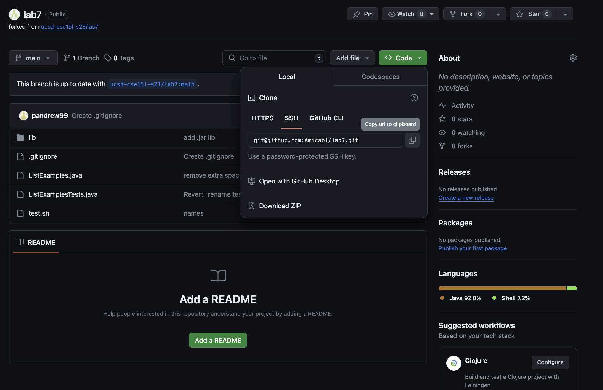
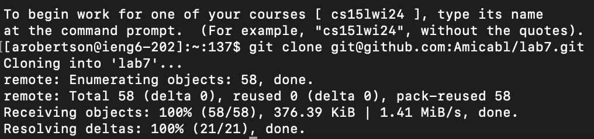
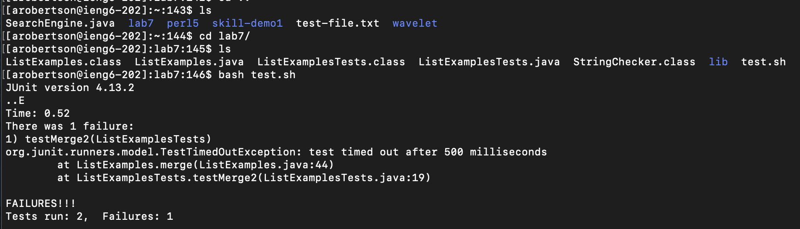
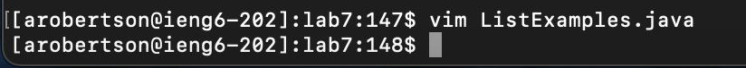
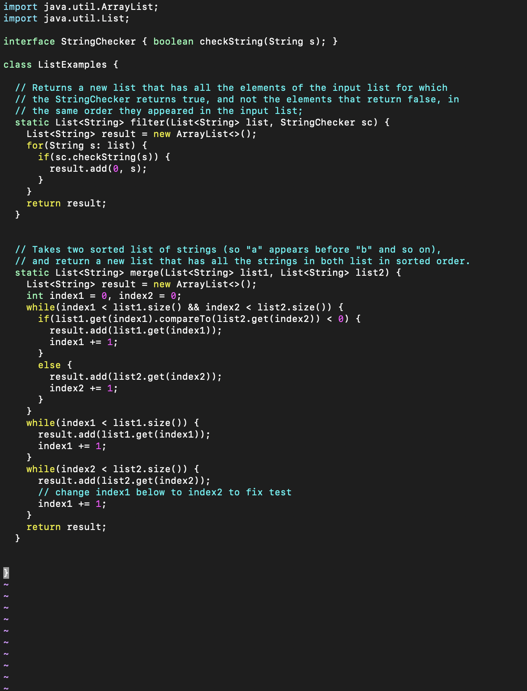
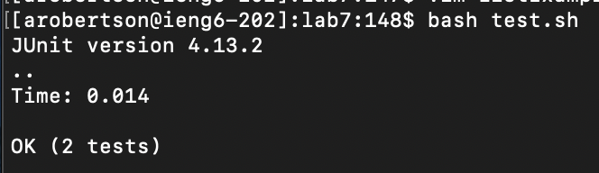
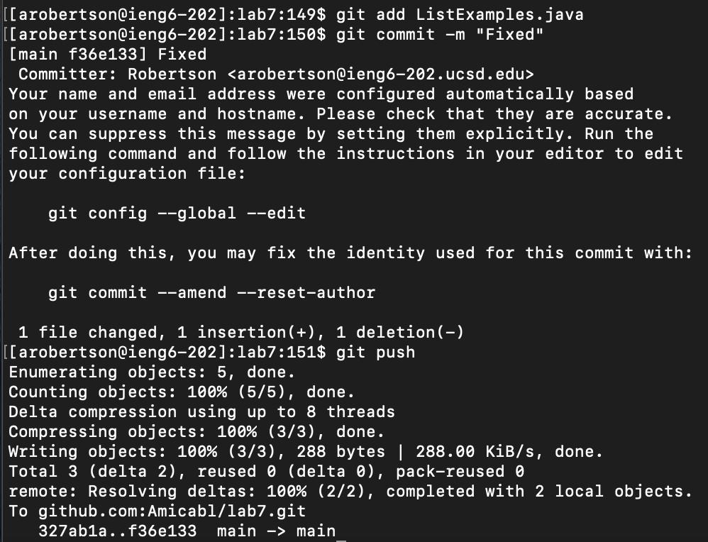

# Lab 4

This lab report will detail my process of completing a task where I use `vim` and `git` command line tools to edit a bug within a clone of a forked repository before pushing the changes back to my Github account. The clone of the forked repository exists on the server `arobertson@ieng6.ucsd.edu`. 

## Logging into ieng6

**Keys pressed:** I directly typed out `ssh arobertson@ieng6.ucsd.edu` in the terminal window and then hit `<enter>`. Because there was no command history, I could not use the `<up>` arrow to more quickly get the command. I also tried using `<tab>` to autofill the server address, but could not since it was not recognized. 

**Summary:** Using the `ssh` command allowed me to connect to the server.

## Cloning my fork of the repository 

To get the `SSH` URL, I went to the fork of the repository on my GitHub account and clicked the "Copy url to clipboard" button.

**Keys pressed:** I typed out `git clone ` and then used `<command>` + `V` to shortcut paste the URL I copied from GitHub into the terminal window. I then hit `<enter>`.

**Summary:** The `git clone` command allowed me to clone a copy of the forked repository on my GitHub account to the server `arobertson@ieng6.ucsd.edu`.

## Running the tests (should fail)

**Keys pressed:** To confirm that the `lab7/` directory was successfully cloned to the server, I started by typing the command `ls` and then hitting `<enter>`. To change my working directory to `lab7/`, I typed the `cd` command and then hit `<space>`. I then started typing `l` and hit `<tab>` to autofill the rest of the directory. I then hit `<enter>`. To see what files were in this directory, I typed the command `ls` again and hit `<enter>`. I saw that there was a `test.sh` file that I could use to run the tests. To run the tests, I started by typing `bash` followed by a `<space>` and then the letter `t`. I hit `<tab>` to autofill the rest of `tests.sh` and hit `<enter` to send the command.

**Summary:** The `ls` and `cd` commands helped me get to the appropriate directory where I could run the tests. The `bash` command was able to run the `tests.sh` file, which included the `javac` and `java` commands to run and compile the `java` files. The tests failed because there is a bug in the code.

## Editing the code file to fix the failing test

**Keys pressed:** To correct the failing test, I knew I needed to use `vim` to fix the error in `ListExamples.java`. I started by typing the command `vim` and then typed out `Li`. I hit `<tab>` which autofilled the command to be `vim ListExamples`. I then typed `.j` and hit `<tab>` again to autofill the rest of the command to be `vim ListExamples.java` and hit `<enter>`. 

**Keys pressed:** Once in the `vim` editor, I hit `<up><up><up><up><up><up>` to bring my cursor to the correct line where I needed to change `index1` to `index2`. By hitting `<left><left><left><left>`, I brought my cursor to the space between `index1` and `+=`. I then hit `i` to change to the `insert` mode on `vim`. I hit `<backspace>` to delete the `1` and hit the `2` key to put `2` instead. The line now reads `index2 += 1;`. Now that I successfully made the correction, I hit `<esc>` to exit the `insert` mode. To save my work and exit `vim`, I wrote `:wq` and hit `<enter>`.

**Summary:** The `vim` editor allowed me to fix the error in `ListExamples.java`. The `insert` mode is what let me make the changes. 

## Running the tests (should succeed)

**Keys pressed:** To run the tests again, I typed out `bash` followed by `<space>` and typed `t`. To autofill, I hit `<tab>` which autofilled the line to be `bash test.sh`. I hit `<enter>` to send the command. The tests now pass.

**Summary:** Compiling and running the tests showed that the tests now pass. 

## Committing and pushing the change to my Github account

**Keys pressed:** To prepare the file for commit, I typed `git add` followed by a `<space>`. I then typed out `Li` and hit `<tab>` to autofill it to `ListExamples.java`. I hit `<enter>`. To commit my changes, I typed `git com` and then hit `<tab>` to autofill the command to `git commit`. I then typed `-m "Fixed"` for my commit message and hit `<enter>`. To push my changes, I typed out `git push` and then hit `<enter>`.

**Summary:** Using `git add`, `commit`, and `push` allowed me to push my changes from the clone I was working on to the forked repository in my GitHub account.

