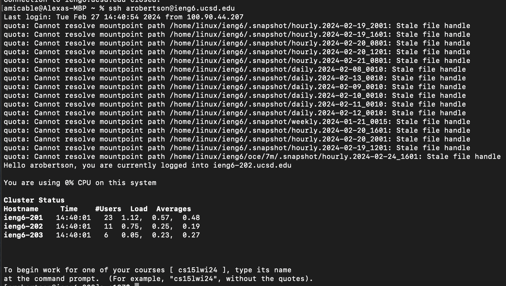

# Lab 4

This lab report will detail my process of completing a task where I use `vim` and `git` command line tools to edit a bug within a clone of a forked repository before pushing the changes back to my Github account. The clone of the forked repository exists on the server `arobertson@ieng6.ucsd.edu`. 

## Logging into ieng6

**Keys pressed:** I directly typed out `ssh arobertson@ieng6.ucsd.edu` in the terminal window. Because there was no command history, I could not use the `<up>` arrow to more quickly get the command. I also tried using `<tab>` to autofill the server address, but could not since it was not recognized. 

## Cloning my fork of the repository 

**Keys pressed:** 
## Running the tests (should fail)
## Editing the code file to fix the failing test
## Running the tests (should succeed)
## Committing and pushing the change to my Github account
