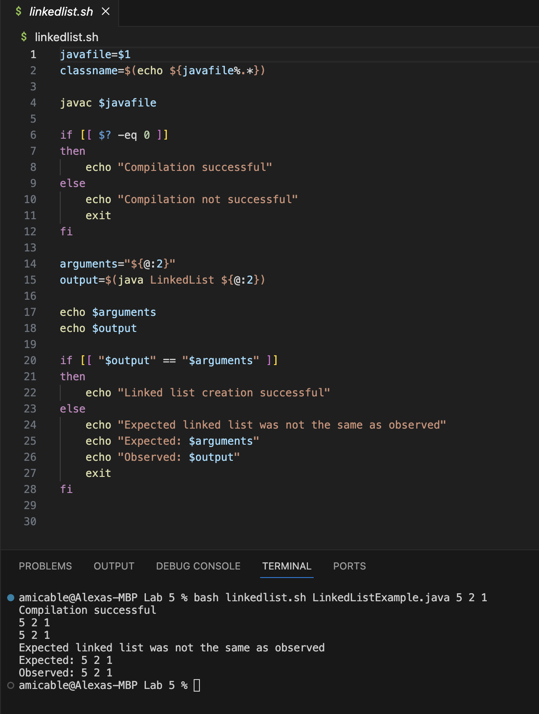

# Lab 5 Report

This lab report will detail a debugging scenario I have created from a subset of the files provided during the Week 4 Lab on Testing. To add more of my own creativity, I have modified the provided `LinkedListExample.java` file by first fixing the original bug and then creating a `main` method. My strategy for this lab report was to code a `bash` file that would perform a function related to Linked Lists and keep working until I encountered an interesting bug. 

# Part 1

## Original Post

Student
> Hello 15L TAs,
> 
> I'm having a problem with my implementation of a linked list. For my project, I created a bash script that takes in a filename and a list of integers. The `main` method in my `LinkedList` class is supposed to take in the integer arguments that are passed into my `bash` script and put them into a new `LinkedList` object. If my linked list implementation is working correctly, then the `toString()` representation of this `LinkedList` should be the same as the arguments I passed in.
>
> I've gotten stuck because the `if` statement in my `bash` script does not seem to be executing correctly. Even though the arguments I've passed in seem to be the same as the output, which I verified by using the `echo` command on the variables `$arguments` and `$output`, my program is still printing out that the "Expected linked list was not the same as observed." At first, I thought maybe I made an error in using `==`, since I know that comparing `Strings` and not `String` references requires the `equals()` method in `Java`. I'm not sure where to go from here.
>
> Please see the screenshot attached with the symptom and the attached files containing my code.



## TA Response

TA
> Hello Student,
>
> You have the right idea by starting to debug using `echo` to print out what is stored in your variables `$arguments` and `$output`. However, I encourage you to think about the limitations of this approach. Printing out the variables, although a good start, does not guarantee that they are equal, even if it may look that way. Could there still be a difference between the variables that might not be visible from the terminal?
>
> Try researching other ways that you could detect a potential difference. What about the length of the `String` stored in each variable?

## Student Follow-Up

After reading the TA's response, the student researched how to find the length of a `String` stored in a `bash` variable. The student then came across the following resource:

Linux Handbook: [https://linuxhandbook.com/bash-string-length/](https://linuxhandbook.com/bash-string-length/)
> If you are dealing with strings in bash, you may need to know the length of string.
>
> Thankfully, getting length of string in bash is super simple. Let's say you have a string named my_string. Its length can be extracted as:
>
>`${#my_string}`

The student then added a couple lines to their `bash` script to check the length of `$arguments` and `$output`. 


When running the command again, the student saw that the length of `$output` was 1 longer than the length of `$arguments`. The student then figured out that there must be an extra space in the `toString()` method within the `LinkedList` class. Upon inspecting the `toString()` method, the student realized that the `while` loop always adds a blank space after the `value` of the `Node`, even if the `Node` is the last one in the `LinkedList`.

## Setup Information

### File and Directory Structure

This file and directory structure was generated using the `tree` command installed on my local computer. The working directory is a folder I created called `Lab 5`.

```
amicable@Alexas-MBP Lab 5 % tree
.
├── LinkedListExample.java
└── linkedlist.sh

1 directory, 2 files
```

### File Contents

**LinkedListExample.java**

``` java
import java.util.NoSuchElementException;

class Node {
    int value;
    Node next;
    public Node(int value, Node next) {
        this.value = value;
        this.next = next;
    }
}
class LinkedList {
    Node root;
    public LinkedList() {
        this.root = null;
    }
    /**
     * Adds the value to the _beginning_ of the list
     * @param value
     */
    public void prepend(int value) {
        // Just add at the beginning
        this.root = new Node(value, this.root);
    }
    /**
     * Adds the value to the _end_ of the list
     * @param value
     */
    public void append(int value) {
        if(this.root == null) {
            this.root = new Node(value, null);
            return;
        }
        // If it's just one element, add if after that one
        Node n = this.root;
        if(n.next == null) {
            n.next = new Node(value, null);
            return;
        }
        // Otherwise, loop until the end and add at the end with a null
        while(n.next != null) {
            n = n.next;
        }
        n.next = new Node(value, null);
    }

    /**
     * @return the value of the first element in the list
     */
    public int first() {
        return this.root.value;
    }
    /**
     * @return the value of the last element in the list
     */
    public int last() {
        Node n = this.root;
        // If no such element, throw an exception
        if(n == null) { throw new NoSuchElementException(); }
        // If it's just one element, return its value
        if(n.next == null) { return n.value; }
        // Otherwise, search for the end of the list and return the last value
        while(n.next != null) {
            n = n.next;
        }
        return n.value;
    }
    /**
     * @return a string representation of the list
     */
    public String toString() {
        Node n = this.root;
        String s = "";
        while(n != null) {
            s += n.value + " ";
            n = n.next;
        }
        return s;
    }
    /**
     * @return the number of elements in the list
     */
    public int length() {
        Node n = this.root;
        int i = 0;
        while(n != null) {
            i += 1;
            n = n.next;
        }
        return i;
    }

    /**
     * This main method takes in a list of arguments and uses them
     * to populate a LinkedList.
     * 
     * @param args The integers to populate the LinkedList with. 
     */
    public static void main (String[] args) {
        // Creates a new LinkedList
        LinkedList myLinkedList = new LinkedList();

        // Creates the first node from the first argument and sets root
        Node rootNode = new Node(Integer.valueOf(args[0]),null);
        myLinkedList.root = rootNode;

        // Uses the append method to add the subsequent arguments
        for (int i = 1; i < args.length; i++) {
            myLinkedList.append(Integer.valueOf(args[i]));
        }

        // Prints out the toString representation of the list
        System.out.println(myLinkedList.toString());
    }
}
```

**linkedlist.sh**
``` bash
# Takes in the filename as an argument
javafile=$1

# Extracts the class name from the filename
classname=$(echo ${javafile%.*})

# Compiles the file
javac $javafile

# Echoes whether the compilation was successful based on exit code
if [[ $? -eq 0 ]]
then
    echo "Compilation successful"
else
    echo "Compilation not successful"
    exit
fi

# Saves the rest of the arguments after the file name to a variable
arguments="${@:2}"
# Saves the output of passing in those arguments to the LinkedList class
output=$(java LinkedList ${@:2})

# Included for debugging purposes
echo $arguments
echo $output

# If the outputted toString() of the LinkedList is the same as the arguments,
# code was successful
if [[ "$output" == "$arguments" ]]
then
    echo "Linked list creation successful"
else
    echo "Expected linked list was not the same as observed"
    echo "Expected: $arguments"
    echo "Observed: $output"
    exit
fi
```

### Commands Run

`bash linkedlist.sh LinkedListExample.java 5 2 1`

### Description of How to Fix

To fix the bug, the student can either remove the extra whitespace from the `String` stored in `$output` by slicing the `String`, or can modify the `toString()` method to avoid putting the extra whitespace when the `Node` is the last element in the LinkedList. I would recommend the second approach.

Here is what the modified code for `toString()` would look like:
``` java
/**
     * @return a string representation of the list
     */
    public String toString() {
        Node n = this.root;
        String s = "";
        while(n != null) {
            if (n.next == null) {
                s += n.value;
            else {
                s += n.value + " ";
            }
            n = n.next;
        }
        return s;
    }
```

The addition of an `if-else` statement determines whether or not this is the last `Node` in the `LinkedList` by checking if this `Node`'s `next` is null. If `next` is null, then this is the last `Node` in the list. In this case, the extra whitespace is not concatenated to `s`.

# Part 2

One interesting thing I learned from the second half of lab was how to use `jdb` to debug my code. I think it's particularly helpful for infinite `while` loops. Before, I would have to guess which `while` loop was causing the problem and comment things out until the infinite loop stopped. Now, I can set a breakpoint using `jdb` and go through step by step to see what exactly is causing the infinite loop and how the variables are changing with each step. 


